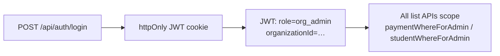

# Full Admin flow (org admin)

School-level operators: **org admin** role, tied to **one** `Organization`. No access to other tenants’ data or to the platform **Master console**.

**How they sign in:** see **[SCHOOL_ADMIN_LOGIN.md](./SCHOOL_ADMIN_LOGIN.md)** (`/school/login`, master provisioning, navigation links).

---

## 1. Identity & session

1. School staff open **`/school/login`** or **`/admin/login?school=1`** (same form; optional **`?orgSlug=`** for UI banner via `GET /api/public/organizations`). Platform masters use **`/admin/login?master=1`**.
2. **`POST /api/auth/login`** validates credentials; issues JWT with **`role: org_admin`** and **`organizationId`**.
3. **`GET /api/auth/me`** returns profile + **`organizationSlug`** / name for the workspace bar.

**Redirects:** Cannot land on **`/admin/master`** — server layout redirects to **`/admin`**.

**Aliases:** **`/school-admin`** rewrites to **`/admin`** (`next.config.ts`).

---

## 2. Primary navigation (`TuitionAdminShell`)

| Route | Label | Backend |
|-------|-------|---------|
| `/admin` | Dashboard | `GET /api/admin/summary` |
| `/admin/profile` | Profile | `GET /api/auth/me`, `PATCH /api/auth/admin/profile`, profile image routes |
| `/admin/tuition-balance` | Tuition balance | `GET /api/admin/tuition-balances` |
| `/admin/students` | Students | `GET /api/students` |
| `/admin/students/[id]` | Student detail | `GET /api/students/:id` |
| `/admin/payments` | Payments | `GET /api/payments`, filters |
| `/admin/payment-requests` | Payment requests | `GET /api/admin/payment-requests` |
| `/admin/virtual-cards` | Virtual cards | `GET /api/admin/openpay-cards` |
| `/admin/programmes` | Programmes | `GET/POST /api/admin/programmes`, fees |
| `/admin/receipts` | Receipts | `GET /api/receipts/:id`, PDF |
| `/admin/reports` | Reports | `GET /api/admin/summary`, `GET /api/payments/export` |
| `/admin/users` | Users | `GET /api/admin/org-users` |
| `/admin/settings` | Settings | Org config; password on **Profile** |

All list/export calls use **`paymentWhereForAdmin` / `studentWhereForAdmin`** → **`organizationId`** from JWT only.

---

## 3. Workspace bar & search

- **`AdminWorkspaceBar`** shows **workspace name**, **`/pay/<slug>`** link, bookmarkable login link.
- **`AdminGlobalSearch`** — search students/payments **within the org** only.

---

## 4. Dashboard extras

- **FX block** — `GET /api/fx/rate` (session org). **`POST`** records FX for this org.
- **Monthly chart / KPIs** — From **`/api/admin/summary`**.

---

## 5. Payment operations

- **List / filter** — Query params `status`, `rail`, `studentId`, `limit`.
- **Detail / patch** — **`/api/payments/:id`**
- **Receipts** — **`/api/receipts/:id`**, PDF route

---

## 6. What org admins cannot do

| Action | Reason |
|--------|--------|
| Open **`/admin/master`** | Master layout enforces **master** role |
| Pass **`?orgSlug=`** to see another school | JWT scope wins |
| Approve workspace requests | Master APIs only |

---

## 7. Related code

| Area | Location |
|------|----------|
| Scope helpers | `lib/scope.ts` |
| Tuition shell | `app/admin/(tuition-hub)/layout.tsx`, `TuitionAdminShell.tsx` |
| Admin pages | `app/admin/(tuition-hub)/**` |
