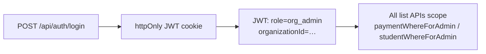

# Full Admin flow (org admin)

School-level operators: **org admin** role, tied to **one** `Organization`. No access to other tenants’ data or to the platform **Master console**.

**How they sign in:** see **[SCHOOL_ADMIN_LOGIN.md](./SCHOOL_ADMIN_LOGIN.md)** (`/school/login`, master provisioning, navigation links).

---

## 1. Identity & session

1. School staff open **`/school/login`** or **`/admin/login?school=1`** (same form; optional **`?orgSlug=`** for UI banner via public org endpoint). Platform masters use **`/admin/login?master=1`**.
2. **`POST /api/auth/login`** validates credentials; issues JWT with **`role: org_admin`** and **`organizationId`**.
3. **`GET /api/auth/me`** returns profile + **`organizationSlug`** / name for the workspace bar.

**Redirects:** Cannot land on **`/admin/master`** — server layout redirects to **`/admin`**.

---

## 2. Primary navigation

| Step | Route | Backend |
|------|-------|---------|
| Dashboard | `/admin` | `GET /api/admin/summary` (scoped) |
| Students | `/admin/students` | `GET /api/students` |
| Student detail | `/admin/students/[id]` | `GET /api/students/:id` (403 if wrong org) |
| Payments | `/admin/payments` | `GET /api/payments`, filters |
| Export | button | `GET /api/payments/export` |

All **`GET`** list/export calls use **`paymentWhereForAdmin` / `studentWhereForAdmin`** → **`organizationId`** from JWT only.

---

## 3. Workspace bar & search

- **`AdminWorkspaceBar`** (in **`admin/layout.tsx`**) shows **workspace name**, **`/pay/<slug>`** link, bookmarkable login link.
- **`AdminGlobalSearch`** — search students/payments **within the org** only (masters get extra behaviour; org admin never sees other orgs).

---

## 4. Dashboard extras

- **FX block** — Loads **`GET /api/fx/rate`** without `orgSlug` (session resolves org). **`POST`** records a new FX row for **this** org only.
- **Monthly chart / KPIs** — From **`/api/admin/summary`** scoped to the org.

---

## 5. Payment operations

- **List / filter** — Query params `status`, `rail`, `studentId`, `limit`.
- **Detail / patch** — **`/api/payments/:id`** — update status, tx hash, MoMo reference if payment belongs to org.
- **Receipts** — **`/api/receipts/:id`**, PDF route — admin can preview non-confirmed where implemented.

---

## 6. What org admins cannot do

| Action | Reason |
|--------|--------|
| Open **`/admin/master`** | Server **layout** enforces **master** only |
| Pass **`?orgSlug=`** to “see” another school | **JWT** scope wins; slug query is ignored for org-scoped reads |
| Approve workspace requests | **Master** APIs only |

---

## 7. Related code

| Area | Location |
|------|----------|
| Scope helpers | `lib/scope.ts` |
| Admin layout / bar | `app/admin/layout.tsx`, `AdminWorkspaceBar.tsx`, `AdminGlobalSearch.tsx` |
| Admin pages | `app/admin/page.tsx`, `students/`, `payments/` |
