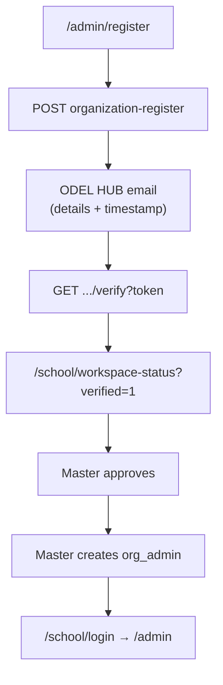

# App status audit (holistic scan)

**Last reviewed:** 2026-06-04 · **Scope:** registration, approval, email verification, auth, pay, programmes, UI/docs sync, deployment.

**Full holistic scan:** [HOLISTIC_APP_AUDIT.md](./HOLISTIC_APP_AUDIT.md) · **Backlog (canonical):** [BACKLOG.md](./BACKLOG.md) · **LivePay:** [LIVEPAY_INTEGRATION_ASSESSMENT.md](./LIVEPAY_INTEGRATION_ASSESSMENT.md)

---

## Executive summary

| Area | Status |
|------|--------|
| School workspace self-register + email verify → `/school/login` | **Implemented** |
| Master approve / reject + email gate before approve | **Implemented** |
| School admin login after master creates `org_admin` | **Implemented** (manual provisioning) |
| Guest pay (`PayWizard` + public checkout APIs) | **Implemented** |
| School admin programme/fee customization | **Implemented** (wallet/FX/fee platform = master) |
| Production email delivery | **Requires** `RESEND_*` + `NEXT_PUBLIC_APP_URL` |

---

## 1. Registration → verification → approval → login

| Step | Detail |
|------|--------|
| Register | `tenantStatus: pending`, contact email **required** on self-serve |
| Email | HTML + plain text; 72h token; includes school name, slug, email, submitted time (Africa/Kampala), notes |
| Verify redirect | **`/school/login`** (rewrites to `/admin/login?school=1`) |
| Approve gate | Master cannot approve until email verified (when contact email set) |
| Dashboard access | Master creates **`org_admin`** on **active** org only; school uses **`/school/login`** |

**Alternate path:** Master **Create pending tenant** — contact email may be auto-marked verified (no inbox flow).

**Docs:** [ORGANIZATION_REGISTRATION.md](./ORGANIZATION_REGISTRATION.md), [SCHOOL_ADMIN_LOGIN.md](./SCHOOL_ADMIN_LOGIN.md), [LOCAL_DEV_AND_CREDENTIALS.md](./LOCAL_DEV_AND_CREDENTIALS.md)

---

## 2. Guest payer flow

- Entry: `/pay`, `/pay/<orgSlug>`, deep link `?programmes=1`
- **Active tenant only** — pending/rejected slugs show unavailable UI (not a checkout loop)
- APIs: public checkout (`/api/public/checkout/*`), programmes, FX — see [USER_FLOW.md](./USER_FLOW.md)

---

## 3. School admin programme customization

See **[SCHOOL_ADMIN_PROGRAMMES.md](./SCHOOL_ADMIN_PROGRAMMES.md)**.

---

## 4. UI vs codebase (resolved / known)

| Issue | Resolution |
|-------|------------|
| Inactive slug “Programmes” link looped on pay error page | Fixed — links to register / pay index |
| Expired verify told users to re-register only | Fixed — points to resend on `/admin/register` |
| Middleware sent expired sessions to bare `/admin/login` | Fixed — tuition paths → `/school/login`, master → `?master=1` |
| Footer “Student” → protected `/student` | Fixed → `/student/login` |
| Payer docs listed legacy `/api/students` + `/api/collect/momo` for PayWizard | Updated in [USER_FLOW.md](./USER_FLOW.md) |
| `docs/UI_VS_CODEBASE.md` stale admin login mapping | Regenerated via `npm run docs:inventory` (2026-06-03) |

---

## 5. Robustness fixes (this pass)

- Production register returns **503** when workspace saved but verification email not sent (UI shows resend).
- Verification email includes **plain-text** part for clients without HTML.
- Programme PATCH enforces **active** tenant for `org_admin`.
- Centralized **`WORKSPACE_VERIFY_FAIL_MESSAGES`** for verify + login UX.

---

## 6. Deployment readiness

| Requirement | Notes |
|-------------|--------|
| `DATABASE_URL` | MongoDB |
| `JWT_SECRET` | ≥ 16 chars |
| `NEXT_PUBLIC_APP_URL` | Must match public URL (verify links, webhooks) |
| `RESEND_API_KEY`, `RESEND_FROM` | Workspace verification email |
| `CRON_SECRET` | TON confirm cron |
| Mbiyo live keys | Production payin |
| `npm run db:push` | Includes `OrganizationWorkspaceVerifyToken`, `registrationEmailVerifiedAt` |
| Template org `default` | Required for approve clone |
| Smoke tests | [PRODUCTION_GO_LIVE.md](./PRODUCTION_GO_LIVE.md) |

**CI:** `npm run verify` — lint, tests, `tsc`, prisma validate. Vitest stubs `server-only` via `vitest.config.ts`; runtime uses the `server-only` npm package.

---

## 7. Security hardening (2026-06-03)

See **[SECURITY_HARDENING.md](./SECURITY_HARDENING.md)** — IDOR fixes, receipt tokens, webhook amount checks, auth gates, rate limits, CSP/HSTS.

---

## 8. Backlog (implemented 2026-06-04)

| Item | Status |
|------|--------|
| Auto-invite email when master creates org admin | **Done** — `lib/org-admin-invite-email.ts`, `POST /api/master/admins` |
| Master dashboard `?orgSlug=` filtering | **Done** — `GET /api/admin/summary?organizationSlug=`, dashboard banner |
| Re-open **rejected** tenants | **Done** — `PATCH` action `reopen` → `pending` |
| LivePay integration (Uganda MTN/Airtel) | **Done** — checkout + webhook; enable with `LIVEPAY_*` env |
| Consolidate master org desktop + mobile card UI | Low |
| Legacy URA `POST /api/admin/login` vs tuition JWT — document Play-only scope | Low |

## 9. Open backlog (scan 2026-06-09)

Prioritized inventory: **[BACKLOG.md](./BACKLOG.md)**. Items from the 2026-06-04 scan are **done** (admin search, `AdminWorkspaceBar`, master `?orgSlug=` on dashboard/students/payments/reports, invite reset links, distributed rate limits, JWT split).

| Area | Open work |
|------|-----------|
| Ops | Production TON wallet + webhook dashboard alignment — [DEPLOYMENT_ENV_PRODUCTION.md](./DEPLOYMENT_ENV_PRODUCTION.md) |
| Product | OpenPayGB virtual card program — [VIRTUAL_CARD_INVESTIGATION.md](./VIRTUAL_CARD_INVESTIGATION.md) |
| Product | **OPGB settlement ledger** (Phase 1 shipped: 1 OPGB = 1 UGX) — [OPGB_TOKEN_ECOSYSTEM.md](./OPGB_TOKEN_ECOSYSTEM.md) |
| Low | Master org UI consolidation (single `MasterOrgRow`); URA game `apiErrorResponse` (~200 routes) |
| Docs | Regenerate `docs:inventory` after new routes (`/api/platform/chat/suggest`) |

---

## 10. Documentation index (where topics are saved)

| Topic | Document |
|-------|----------|
| OPGB / DEX / wallet architecture | [OPGB_TOKEN_ECOSYSTEM.md](./OPGB_TOKEN_ECOSYSTEM.md) |
| Workspace self-register + verify portal | [SCHOOL_WORKSPACE_SELF_REGISTER.md](./SCHOOL_WORKSPACE_SELF_REGISTER.md), [ORGANIZATION_REGISTRATION.md](./ORGANIZATION_REGISTRATION.md) |
| `.env` ↔ Master Admin | [LOCAL_DEV_AND_CREDENTIALS.md](./LOCAL_DEV_AND_CREDENTIALS.md) — `npm run deployment:env-audit` |
| Vercel deploy (`info.edutechos@gmail.com`) | [VERCEL_ODELPAY_DEPLOY.md](./VERCEL_ODELPAY_DEPLOY.md), [DEPLOYMENT_ENV_PRODUCTION.md](./DEPLOYMENT_ENV_PRODUCTION.md) |
| Vercel Preview “Blocked” | [VERCEL_BUILD_FAILURES.md](./VERCEL_BUILD_FAILURES.md) |
| Telegram bot | [TELEGRAM_BOT_DEPLOYMENT.md](./TELEGRAM_BOT_DEPLOYMENT.md) |
| API / UI inventories | `npm run docs:inventory` → [API_INVENTORY.csv](./API_INVENTORY.csv), [UI_ROUTES.csv](./UI_ROUTES.csv) |
| Holistic counts | [HOLISTIC_APP_AUDIT.md](./HOLISTIC_APP_AUDIT.md) |

---

## Key source files

| Area | Path |
|------|------|
| Register API | `app/api/public/organization-register/route.ts` |
| Verify redirect | `app/api/public/organization-register/verify/route.ts` |
| Email | `lib/organization-registration-email.ts` |
| Tokens / approve gate | `lib/organization-workspace-verify.ts` |
| Master approve | `app/api/master/organizations/[id]/route.ts` |
| Create org admin | `app/api/master/admins/route.ts` |
| Programme scope | `lib/admin-programmes-scope.ts` |
| Pay | `app/pay/PayWizard.tsx` |
| Middleware | `middleware.ts` |
