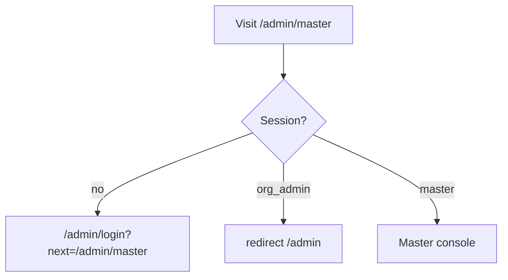

# Full Master Admin flow (platform operator)

**Master** = platform role (`AdminUser.role = master`, **`organizationId` null**). Manages **all** workspaces: create/approve tenants, create **org_admin** users, and drill into a single tenant via **`?orgSlug=`**.

---

## 1. Access control

- **`app/admin/master/layout.tsx`** (Server): requires **`master`**; else redirect as above.
- **Login:** Successful master sign-in goes to **`/admin/master`** (or safe **`?next=`**). See **`safePostLoginRedirect`** (org admins cannot be redirected to master routes).

---

## 2. Master console (`/admin/master`)

| Action | Client | API |
|--------|--------|-----|
| List orgs | page load | **`GET /api/master/organizations`** |
| Create org | form | **`POST /api/master/organizations`** (clone from **`default`** via `provisionOrganizationFromTemplate`) |
| Pending requests | table section | Same list includes **`tenantStatus`**, contact fields |
| Approve / reject | buttons | **`PATCH /api/master/organizations/:id`** `{ action: approve \| reject }` |
| Create org admin | form | **`POST /api/master/admins`** (`email`, `password`, `organizationId`) |

**Approve** activates tenant and clones programmes/FX from **`default`** when possible.

---

## 3. Workspace filter (`?orgSlug=`)

When a master uses the **tenant picker** in **`AdminWorkspaceBar`** (tuition shell header), the query **`?orgSlug=<slug>`** is applied to:

- **`GET /api/admin/summary`**
- **`GET /api/students`**, **`GET /api/payments`**, **`GET /api/payments/export`**
- Master’s FX **POST** (must select a tenant first)

Implementation: **`masterWorkspaceScopeFromRequest`** narrows **`organizationId`** when slug is set; invalid slug → **400**.

**Without** `orgSlug`, masters see **platform-wide** aggregates (dashboard totals across all orgs).

---

## 4. Global search (master)

**`GET /api/admin/search?q=`**

- **No `orgSlug`:** searches **organizations** (name/slug) + students + payments across the platform (limits apply).
- **With `orgSlug`:** same as org admin — scoped to that org.

UI: **`AdminGlobalSearch`** in the admin layout.

---

## 5. Cross-links

| Goal | Path |
|------|------|
| Master home | **`/admin/master`** |
| Org-scoped dashboard | **`/admin?orgSlug=`** |
| Student deep link | **`/admin/students/:id?orgSlug=`** (preserved in UI) |

---

## 6. Related code

| Area | Location |
|------|----------|
| Master APIs | `app/api/master/**` |
| Master layout guard | `app/admin/master/layout.tsx` |
| Master console UI | `app/admin/master/page.tsx` |
| Org provisioning | `lib/org-provision.ts` |
| Workspace scope | `lib/master-workspace-scope.ts` |
