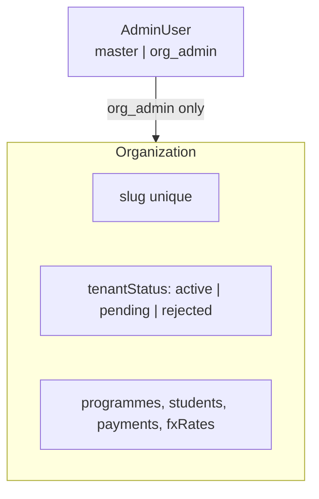
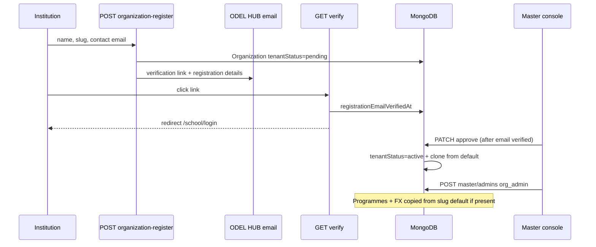

# Full multi-tenant flow

How **organizations (workspaces)** are modeled, resolved, and isolated across HTTP APIs, pay links, admin sessions, Telegram, and self-registration.

---

## 1. Data model (conceptual)

- **`Organization`** — One row per school/workspace; **`slug`** is the public identifier (`default`, `kampala-campus`, …).
- **`tenantStatus`** — **`active`** = live for pay and public APIs; **`pending`** = registration awaiting master; **`rejected`** = blocked.
- **Org admin** — `AdminUser` with `role = org_admin` and **`organizationId`** set; JWT carries that id.
- **Master** — `role = master`, **`organizationId` null**; sees all orgs when listing, but must pass **`?orgSlug=`** for org-scoped *read* APIs that use `resolveOrganizationForRead`.

---

## 2. Resolving the tenant on each request

Central helper: **`resolveOrganizationForRead(req, admin)`** in `lib/resolve-org-api.ts`.

| Caller | `orgSlug` in URL | Resolved tenant |
|--------|------------------|-----------------|
| **Not logged in** | Required | **`getActiveOrganizationBySlug`** — must be **active** |
| **org_admin** | Ignored | Always **JWT `organizationId`** (cannot hop tenants via query) |
| **master** | Required for org-scoped reads | **`getOrganizationBySlug`** (any status, for operator tooling) |

**Public pay & checkout** only use **active** slugs (`getActiveOrganizationBySlug` in `lib/organizations.ts`). Pending/rejected orgs do not accept payments.

---

## 3. Where the slug appears

| Flow | Mechanism |
|------|-----------|
| Web pay | Path **`/pay/<orgSlug>`**; queries **`?orgSlug=`** on API calls from `PayWizard` |
| Master viewing one school | Admin UI **`?orgSlug=`** on dashboard, students, payments, export, FX (see `masterWorkspaceScopeFromRequest`) |
| Org admin | No slug in URL required — session is scoped by JWT |
| Telegram bot | Env **`TELEGRAM_ORG_SLUG`** — single org per deployment for the bot |
| Registration | User submits slug on **`/admin/register`** → org created **pending** |

---

## 4. Lifecycle — new workspace (registration)

1. **`POST /api/public/organization-register`** creates org **`pending`** (rate limited) and emails a **verification link** (registration details + timestamp).
2. Applicant opens **`GET /api/public/organization-register/verify?token=…`** → **`registrationEmailVerifiedAt`** → redirect **`/school/login`**.
3. **`POST /api/public/organization-register/resend`** if the link expired (rate limited).
4. Master **approves** via **`PATCH /api/master/organizations/:id`** (`action: approve`) — blocked until email verified when contact email was provided — or **reject**.
5. **Approve** sets **`active`** and runs **`provisionOrganizationFromTemplate`** (clone programmes + FX from **`default`** when it exists).
6. Master creates **`org_admin`** via **`POST /api/master/admins`**; school signs in at **`/school/login`**.

Detail: [ORGANIZATION_REGISTRATION.md](./ORGANIZATION_REGISTRATION.md).

---

## 5. Isolation rules (summary)

| Resource | Org admin | Master (no `?orgSlug=`) | Master (`?orgSlug=` set) |
|----------|-----------|-------------------------|---------------------------|
| List payments/students/summary | Own org only | **All orgs** (aggregates) | **Filtered** to that org |
| `GET` single payment/student | Own org only | Cross-org with id (use carefully) | Same |
| Programmes/FX public API | N/A (uses JWT org) | Must pass **`orgSlug`** | Same |

**Creates** (`POST /api/students` with body `organizationSlug`) only succeed for **active** orgs.

---

## 6. Related code

| Topic | Location |
|-------|----------|
| Org helpers | `lib/organizations.ts`, `lib/org-provision.ts` |
| Resolve org for APIs | `lib/resolve-org-api.ts` |
| Master scope filter | `lib/master-workspace-scope.ts` |
| Prisma schema | `prisma/schema.prisma` (`Organization`, `OrganizationTenantStatus`) |
