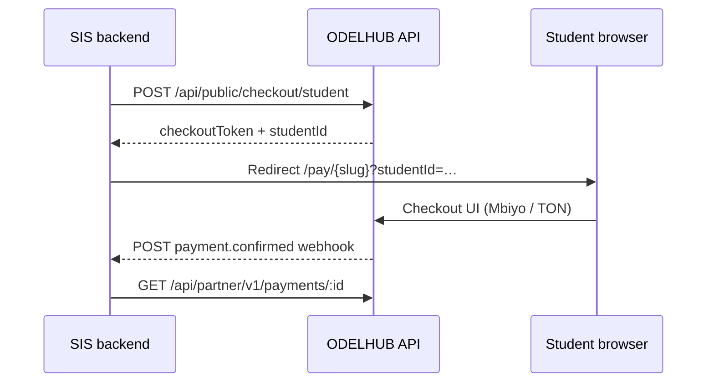

# SIS integration cookbook

Step-by-step checkout integration for student information systems. Base URL: `https://<your-odelhub-domain>`.

**Prerequisites:** School `organizationSlug` is **active** (master-approved). For server-to-server ledger sync, issue a Partner API key ([PARTNER_API.md](./PARTNER_API.md)).

---

## Flow overview



---

## 1. List programmes and quote

### Programmes

```http
GET /api/programmes?orgSlug=kampala-campus
```

**200**

```json
{
  "programmes": [
    {
      "code": "BSC-CS",
      "name": "BSc Computer Science",
      "track": "regular"
    }
  ]
}
```

### Quote (amounts + TON wallet)

```http
GET /api/programmes/BSC-CS/quote?orgSlug=kampala-campus&year=1&semester=1
```

**200** (fields abbreviated)

```json
{
  "programmeCode": "BSC-CS",
  "year": 1,
  "semester": 1,
  "tuitionUgx": 1200000,
  "functionalFeesUgx": 50000,
  "platformFeeUgx": 5000,
  "totalUgx": 1255000,
  "ugxPerTon": 98500,
  "tonAmount": 12.74,
  "destinationWallet": "UQ…"
}
```

---

## 2. Register or resume student (checkout session)

### New student

```http
POST /api/public/checkout/student
Content-Type: application/json

{
  "organizationSlug": "kampala-campus",
  "name": "Jane Okello",
  "email": "jane.okello@example.com",
  "phone": "+256700000000",
  "programmeCode": "BSC-CS",
  "year": 1,
  "semester": 1
}
```

**201**

```json
{
  "student": {
    "id": "665f10000000000000000002",
    "name": "Jane Okello",
    "programmeCode": "BSC-CS",
    "year": 1,
    "semester": 1
  },
  "checkoutToken": "eyJhbGciOiJIUzI1NiIsInR5cCI6IkpXVCJ9…"
}
```

Response also sets HttpOnly cookie `odelhub_checkout` when called from a browser.

### Resume existing student (deep link)

```http
POST /api/public/checkout/session
Content-Type: application/json

{
  "organizationSlug": "kampala-campus",
  "studentId": "665f10000000000000000002",
  "email": "jane.okello@example.com"
}
```

`email` is required when the student record already has an email on file.

**200**

```json
{
  "ok": true,
  "checkoutToken": "eyJhbGciOiJIUzI1NiIsInR5cCI6IkpXVCJ9…"
}
```

**SIS pattern:** Store `checkoutToken` server-side; pass to your front-end or use as `Authorization: Bearer` / `x-checkout-token` on subsequent API calls.

---

## 3. Balance check (optional)

```http
GET /api/public/checkout/balance?organizationSlug=kampala-campus&studentId=665f10000000000000000002&programmeCode=BSC-CS&year=1&semester=1
x-checkout-token: eyJhbGciOiJIUzI1NiIsInR5cCI6IkpXVCJ9…
```

**200**

```json
{
  "balanceUgx": 0,
  "canPay": true,
  "message": ""
}
```

---

## 4. Start payment

### Pending payment record

```http
POST /api/public/checkout/payment
Content-Type: application/json
x-checkout-token: eyJhbGciOiJIUzI1NiIsInR5cCI6IkpXVCJ9…

{
  "organizationSlug": "kampala-campus",
  "studentId": "665f10000000000000000002",
  "programmeCode": "BSC-CS",
  "year": 1,
  "semester": 1,
  "rail": "mbiyo",
  "feeSelectionMode": "semester"
}
```

**200**

```json
{
  "payment": {
    "id": "665f1a2b3c4d5e6f7a8b9c0d",
    "totalUgx": 1255000,
    "tonAmount": 12.74,
    "status": "pending",
    "memo": "ODELHUB-665f1a2b…"
  }
}
```

### Mobile money collect (Mbiyo)

```http
POST /api/public/checkout/mbiyo-start
Content-Type: application/json
x-checkout-token: eyJhbGciOiJIUzI1NiIsInR5cCI6IkpXVCJ9…

{
  "organizationSlug": "kampala-campus",
  "paymentId": "665f1a2b3c4d5e6f7a8b9c0d",
  "phone": "256700000000"
}
```

Follow `mbiyo.checkoutUrl` or operator instructions in the response body.

---

## 5. Poll status (until confirmed)

```http
GET /api/payments/665f1a2b3c4d5e6f7a8b9c0d/public
```

**200 (pending)**

```json
{
  "payment": {
    "id": "665f1a2b3c4d5e6f7a8b9c0d",
    "status": "pending",
    "totalUgx": 1255000
  }
}
```

**200 (confirmed)**

```json
{
  "payment": {
    "id": "665f1a2b3c4d5e6f7a8b9c0d",
    "status": "confirmed",
    "confirmedAt": "2026-05-18T10:22:00.000Z"
  }
}
```

Prefer **outbound webhooks** for production instead of polling ([PARTNER_API.md](./PARTNER_API.md)).

---

## 6. Receipt

```http
GET /api/receipts/665f1a2b3c4d5e6f7a8b9c0d
```

Public when payment is `confirmed`.

---

## Embedded UI (simplest path)

Redirect the student to:

```
https://<domain>/pay/kampala-campus
```

Optional query: `?studentId=665f10000000000000000002` (triggers email verification + session flow in PayWizard).

---

## Error codes (common)

| HTTP | Meaning |
|------|---------|
| 400 | Invalid body / validation |
| 401 | Missing or invalid checkout token |
| 403 | Email mismatch on session resume |
| 404 | Unknown org slug or student |
| 409 | Balance guard (already paid / installment rules) |
| 429 | Rate limited |

---

## BFF recommendation

Browser clients on another origin should **not** call ODELHUB APIs directly (no global CORS). Run a small backend-for-frontend on your domain that:

1. Holds the Partner API key or proxies checkout with `x-checkout-token`.
2. Verifies outbound webhook signatures before updating your SIS ledger.

See [INTEGRATION_HARDENING.md](./INTEGRATION_HARDENING.md).
