# Full user flow (payer & public)

Describes what an **end user** (student / payer) experiences without admin credentials: marketing site, tenant-specific pay, optional MoMo bridge, and receipts. Telegram is summarized here; detail lives in `lib/telegram/`.

For local URLs and seed credentials see **[LOCAL_DEV_AND_CREDENTIALS.md](./LOCAL_DEV_AND_CREDENTIALS.md)**.

---

## 1. Actors & entry points

| Actor | Typical entry |
|-------|----------------|
| Prospective payer | `/` (home), header links |
| Payer for a **specific school** | `/pay/<orgSlug>` or `/pay` (school picker) |
| Payer with bookmark | `/pay/<orgSlug>` (must be **active** tenant) |
| Receipt verifier | `/receipt/<paymentId>` (confirmed payment or admin preview) |

---

## 2. Happy path — web pay (PayWizard)

```mermaid
flowchart LR
  A["/ or /pay"] --> B["/pay/orgSlug"]
  B --> C["Load programmes\nGET /api/programmes?orgSlug="]
  C --> D["Pick programme, year, semester"]
  D --> E["Quote\nGET .../quote?orgSlug="]
  E --> F["Guest identity\nname + email"]
  F --> G["POST /api/public/checkout/student"]
  G --> H["POST /api/public/checkout/payment"]
  H --> I["TON Connect or Mbiyo"]
  I --> J["Polling / public status"]
  J --> K["Confirmed → /receipt/id"]
```

1. **Landing** — User opens `/` or **`/pay/<slug>`** (e.g. `default`). Use **`?programmes=1`** to skip the Get Started modal and open programme selection directly.
2. **Tenant scope** — `PayWizard` sends **`orgSlug`** on programme list, fee quote, and checkout calls so all data attaches to the right **Organization**.
3. **Programme & term** — Client loads programmes and requests a **quote** (UGX fees + FX → TON amount + destination wallet).
4. **Checkout session** — `POST /api/public/checkout/session` when resuming with `studentId` from a link.
5. **Student record** — `POST /api/public/checkout/student` creates or updates a **Student** in that org (rate-limited). Legacy **`POST /api/students`** requires an admin session.
6. **Pending payment** — `POST /api/public/checkout/payment` creates a **Payment**; Mbiyo via **`POST /api/public/checkout/mbiyo-start`** when enabled.
7. **Wallet** — TON Connect sends transfer; memo carries **`ref:<paymentId>`** for matching.
8. **Confirmation** — TonAPI cron (`/api/cron/confirm-ton`) and/or admin `PATCH` can set **confirmed**; client may poll public payment status.
9. **Receipt** — User opens **`/receipt/<paymentId>`** (or API `GET /api/receipts/:id`, PDF route) when allowed.

---

## 3. Mobile Money (Mbiyo / OpenPay)

- **Start:** `POST /api/public/checkout/mbiyo-start` from `PayWizard` after checkout payment is created.
- **Webhook:** `POST /api/webhooks/mbiyo` validates secret and confirms payment.
- Legacy **`POST /api/collect/momo`** and **`POST /api/collect/mbiyo`** exist for older integrations; the tuition hub UI uses **public checkout** routes.

See [MBIYO_WEBHOOK_SETUP.md](./MBIYO_WEBHOOK_SETUP.md).

---

## 4. Telegram bot (single-tenant binding)

- One deployment is tied to **`TELEGRAM_ORG_SLUG`** (default `default`). The bot loads programmes/payments for **that** organization only (`getTelegramOrganization()`).
- Updates arrive at **`POST /api/webhooks/telegram`** (optional secret header, dedupe, rate limit).

---

## 5. Public surfaces (no login)

| Surface | Purpose |
|---------|---------|
| `GET /api/public/organization?slug=` | Display name for **active** org |
| `POST /api/public/organization-register` | Request workspace (**pending**); sends verification email |
| `GET /api/public/organization-register/verify?token=` | Confirm email → redirect **`/school/login`** |
| `POST /api/public/organization-register/resend` | Resend verification link |
| `GET /api/programmes?orgSlug=` | Programme list (active org) |
| `GET /api/fx/rate?orgSlug=` | Active FX for quotes |
| `GET /api/receipts/:paymentId` | Receipt JSON |

---

## 6. Failure & edge cases (user-visible)

| Situation | Behavior |
|-----------|----------|
| Unknown or **inactive** org slug on pay | Unavailable page; links to `/pay`, register, or default hub — not a checkout loop |
| Pending tenant (not yet approved) | Treated as inactive for pay APIs |
| Payment still pending | Receipt page may show “pending”; full receipt when **confirmed** |

---

## 7. Related code (map)

| Area | Location |
|------|----------|
| Home | `app/page.tsx` |
| Pay | `app/pay/*`, `PayWizard.tsx`, `PayProviders.tsx` |
| Receipt | `app/receipt/[paymentId]/page.tsx` |
| Public checkout | `app/api/public/checkout/**` |
| Legacy admin student create | `app/api/students/route.ts` |
