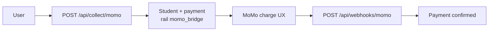

# Full user flow (payer & public)

Describes what an **end user** (student / payer) experiences without admin credentials: marketing site, tenant-specific pay, optional MoMo bridge, and receipts. Telegram is summarized here; detail lives in `lib/telegram/`.

---

## 1. Actors & entry points

| Actor | Typical entry |
|-------|----------------|
| Prospective payer | `/` (home), header links |
| Payer for a **specific school** | `/pay/<orgSlug>` or `/pay` → redirect to `/pay/default` |
| Payer with bookmark | `/pay/<orgSlug>` (must be **active** tenant) |
| Receipt verifier | `/receipt/<paymentId>` (confirmed payment or admin preview) |

---

## 2. Happy path — web pay (TON Connect)

```mermaid
flowchart LR
  A["/ or /pay"] --> B["/pay/orgSlug"]
  B --> C["Load programmes\nGET /api/programmes?orgSlug="]
  C --> D["Pick programme, year, semester"]
  D --> E["Quote\nGET .../quote?orgSlug="]
  E --> F["Enter student details"]
  F --> G["POST /api/students\norganizationSlug"]
  G --> H["POST /api/payments"]
  H --> I["TON Connect + memo ref:paymentId"]
  I --> J["Polling / public status"]
  J --> K["Confirmed → /receipt/id"]
```

1. **Landing** — User opens `/` or goes straight to **`/pay/<slug>`** (e.g. `default`).
2. **Tenant scope** — `PayWizard` sends **`orgSlug`** on programme list, fee quote, and student create so all data attaches to the right **Organization**.
3. **Programme & term** — Client loads programmes and requests a **quote** (UGX fees + FX → TON amount + destination wallet).
4. **Student record** — `POST /api/students` with `organizationSlug` creates a **Student** in that org (rate-limited).
5. **Pending payment** — `POST /api/payments` creates a **Payment** linked to that student/org; rail `web` (or others as implemented).
6. **Wallet** — TON Connect sends transfer; memo carries **`ref:<paymentId>`** for matching.
7. **Confirmation** — TonAPI cron (`/api/cron/confirm-ton`) and/or admin `PATCH` can set **confirmed**; client may poll **public** payment status.
8. **Receipt** — User opens **`/receipt/<paymentId>`** (or API `GET /api/receipts/:id`, PDF route) for QR / PDF when allowed.

---

## 3. Mobile Money bridge (when enabled)

- **Start:** `POST /api/collect/momo` with `organizationSlug` — resolves **active** org, creates student + pending payment, sets references for webhook matching.
- **Webhook:** `POST /api/webhooks/momo` validates secret, confirms payment, triggers downstream hooks (e.g. bridge, notifications).

---

## 4. Telegram bot (single-tenant binding)

- One deployment is tied to **`TELEGRAM_ORG_SLUG`** (default `default`). The bot loads programmes/payments for **that** organization only (`getTelegramOrganization()`).
- Updates arrive at **`POST /api/webhooks/telegram`** (optional secret header, dedupe, rate limit).
- Flow mirrors web conceptually: menus → programme/term → quote → payment instructions → confirmation. Not multi-tenant per chat without extra routing work.

---

## 5. Public surfaces (no login)

| Surface | Purpose |
|---------|---------|
| `GET /api/public/organization?slug=` | Display name for **active** org (login banner, etc.) |
| `POST /api/public/organization-register` | Request new workspace (**pending** until master approves) |
| `GET /api/programmes?orgSlug=` | Programme list (active org) |
| `GET /api/fx/rate?orgSlug=` | Active FX for quotes |
| `GET /api/receipts/:paymentId` | Receipt JSON (rules on pending vs confirmed) |

---

## 6. Failure & edge cases (user-visible)

| Situation | Behavior |
|-----------|----------|
| Unknown or **inactive** org slug on pay | **404** / not found on pay page |
| Pending tenant (not yet approved) | Treated as inactive for pay APIs |
| Payment still pending | Receipt page may show “pending”; full receipt when **confirmed** (unless admin preview) |

---

## 7. Related code (map)

| Area | Location |
|------|----------|
| Home | `app/page.tsx` |
| Pay | `app/pay/*`, `PayWizard.tsx`, `PayProviders.tsx` |
| Receipt | `app/receipt/[paymentId]/page.tsx` |
| Create student / payment APIs | `app/api/students/route.ts`, `app/api/payments/route.ts` |
| MoMo collect | `app/api/collect/momo/route.ts` |
