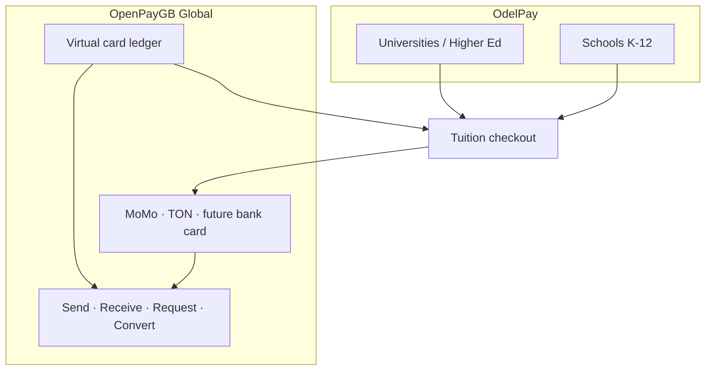

# Payment system architecture — OdelPay & OpenPayGB

**Date:** 2026-07-13 · **Production URL:** `https://odelpay.vercel.app` · **Repo:** [infoedutechos/ODELHUBPay](https://github.com/infoedutechos/ODELHUBPay)

This document organizes the platform into three products and maps planned money-movement features.

---

## 1. Product lines

| Product | Audience | Scope today | Domain / brand |
|---------|----------|-------------|----------------|
| **OdelPay — Higher Institutions** | Universities, polytechnics, tertiary | **Live in this repo** — programmes, semesters, tuition checkout, receipts, TMA | `odelpay.vercel.app`, ODEL HUB Pay |
| **OdelPay — Schools** | Primary / secondary schools | **Same codebase**, school workspace registration (`/school/login`, org self-register) | Same deploy; UI copy & fee models tuned per tenant |
| **OpenPayGB** | Global consumers & partners | Closed-loop card ledger, MoMo/TON rails, future P2P & FX | `lib/open-pay-brand.ts`, `OpenPayCard` model |

### How they relate



**Current reality:** One Next.js app serves all tenants via `Organization` rows. Schools and universities differ by **`institutionTier`** (`university` | `school`), programme structure, fee CSV, and branding — not separate deployments.

**Standalone lobbies (shipped):** Each product line has a dedicated entry route — `/OdelPayUniversities`, `/OdelPaySchools`, `/opgb` — configured in `lib/ecosystem/product-lines.ts`. School tenants show **Term 1–3** in checkout and receipts while the DB still uses the `semester` column; see **[PRODUCT_LINES_AND_SCHOOL_TERMS.md](../platform/PRODUCT_LINES_AND_SCHOOL_TERMS.md)**.

**Schema (shipped):**

```prisma
enum InstitutionTier {
  university
  school
}
// Organization.institutionTier InstitutionTier @default(university)
```

Self-register at `/admin/register` picks the product line (`?segment=higher` or `?segment=schools`). Master Admin can filter orgs by tier (API: `institutionTier` on `GET /api/master/organizations`).

---

## 2. Money features — OdelPay (Universities & Schools)

These four capabilities apply to **both** OdelPay tiers. OpenPayGB provides the rails underneath.

| Feature | User story | Building blocks in repo | Gap |
|---------|------------|-------------------------|-----|
| **Send money** | Parent sends UGX to student wallet / school fee pot | `WalletTransfer`, OPGB ledger sync, `/dex/p2p` escrow | Limits / KYC flags; Telegram notify on send |
| **Receive money** | School receives tuition; student receives refund / stipend | `/pay/{orgSlug}`, webhooks (`livepay`, `relworx`, `mbiyo`, `momo_bridge`) | Refund rail UI polish |
| **Convert** | UGX ↔ TON at checkout; fiat ↔ crypto | `lib/fx-live.ts`, `/dex/convert`, `/dex/amm`, OPGB wallet | On-chain settlement (Phase 5) |
| **Request money** | “Pay this link” / invoice for a fee line | `PaymentRequest` model, `/admin/payment-requests` | Share URL polish for guests |

### Suggested implementation order

1. **Request money** — smallest diff: extend checkout session with `requestId`, shareable `/pay/{org}?request=…`.
2. **Receive money** — already core; expose “payment link generator” in school admin.
3. **Convert** — wire Dex hub quotes into TMA + student portal.
4. **Send money** — new `WalletTransfer` model, limits, KYC flags, Telegram notify.

---

## 3. OpenPayGB (global layer)

OpenPayGB is **not** only tuition. It is the **brand + ledger + PSP orchestration** layer:

| Capability | Status |
|------------|--------|
| Closed-loop UGX card (`OpenPayCard`) | **Shipped** — student opt-in, MoMo/TON fund, pay tuition |
| Master PSP toggles | **Shipped** — `#payment-providers` |
| Real Visa/Mastercard issuing | **Investigation** — see [VIRTUAL_CARD_INVESTIGATION.md](../platform/VIRTUAL_CARD_INVESTIGATION.md) |
| OPGB settlement + Dex (buy/amm/p2p/offramp) | **Phase 4 shipped** — see [OPGB_TOKEN_ECOSYSTEM.md](../platform/OPGB_TOKEN_ECOSYSTEM.md) |
| Global send/receive/convert | **Partial** — Dex hub + custodial ledger; on-chain delivery Phase 5 |

School and university tenants **consume** OpenPayGB rails; they do not run separate card programs unless Master enables overrides per org.

---

## 4. Guest card creation — can we implement it?

### Today (as shipped)

| Rule | Detail |
|------|--------|
| Card holder | **Must be a `Student` row** — `OpenPayCard.studentId` is `@unique` |
| Opt-in API | `POST /api/student/openpay-card/opt-in` requires **student session cookie** |
| Guest at `/pay` | May **spend** from an existing card if checkout session links `studentId` + active card |
| Guest cannot | Issue, fund, or opt into a new card without logging in |

See [OPENPAYGB_PLATFORM_CARD.md](../platform/OPENPAYGB_PLATFORM_CARD.md) § Guest payers.

### Can we implement guest card creation?

**Yes — three viable designs:**

| Option | Description | Effort | Fits OpenPayGB global? |
|--------|-------------|--------|------------------------|
| **A. Post-pay claim (extend current)** | Guest pays tuition → `/student/claim` sets password → opt-in card | **Low** — mostly UX | Tuition-only |
| **B. Lightweight guest signup** | `POST /api/public/guest-card/register` creates minimal `Student` (email, name, org) + pending card | **Medium** — reuses schema | Good for OdelPay |
| **C. Holder-centric card** | New `OpenPayCardHolder` (email/phone, KYC status) decoupled from `Student`; optional link later | **Higher** — schema migration | **Best for OpenPayGB global** |

**Recommendation**

- **OdelPay (schools + universities):** Option **B** — guest enters email + phone on `/pay` or `/card/get`, gets OTP, receives pending card, funds via MoMo, later links to full student record when enrolled.
- **OpenPayGB global:** Option **C** — card is a wallet identity; tuition is one “spend category.”

**Compliance note:** Any guest issuance needs rate limits, email/phone verification, and Master-toggle `guestCardEnabled` (mirror `openPayCardEnabled` on `SiteUiSettings`).

---

## 5. Telegram bot (Master Admin → Vercel)

1. BotFather token → Master Admin **`/admin/master#deployment-environment`** → paste **`TELEGRAM_BOT_TOKEN`** (or **`BOT_TOKEN`**).
2. **Save** → **Sync to Vercel** (requires `VERCEL_ACCESS_TOKEN` + `VERCEL_PROJECT_ID` in same panel).
3. Local check: `npm run telegram:alignment-check` (expects `TELEGRAM_BOT_TOKEN` in `.env` / `.env.local`).
4. Production webhook: `npm run telegram:set-webhook` after deploy.

See [TELEGRAM_BOT_DEPLOYMENT.md](../deployment/TELEGRAM_BOT_DEPLOYMENT.md).

---

## 6. OPGB / Dex — local test loop

```bash
npm run db:push && npm run seed
```

| Step | URL / credentials |
|------|-------------------|
| Student login | `/student/login` — slug `default`, `student@odelhub.local` / `ChangeMe_Student123!` |
| Fund OPGB | `/student/card` (MoMo top-up) |
| Buy crypto | `/dex/buy` (signed in → instant OPGB settle) |
| Swap | `/dex/amm` |
| P2P | `/dex/p2p` → accept → release / cancel / dispute |
| Withdraw | `/dex/offramp` |

**Dex Hub** is linked from every signed-in dashboard sidebar (student, school admin, master).

**Phase 5 pending:** on-chain crypto delivery and live MoMo/bank/TON disbursement APIs (provider payout credentials + custody). **Shipped:** master P2P dispute resolve + withdraw queue at `/admin/master/opgb-ops`.

---

## 7. Deployment note

Code on `main` passes CI. Production at `https://odelpay.vercel.app` requires a **Vercel production deployment** — see [VERCEL_ODELPAY_DEPLOY.md](../deployment/VERCEL_ODELPAY_DEPLOY.md).
