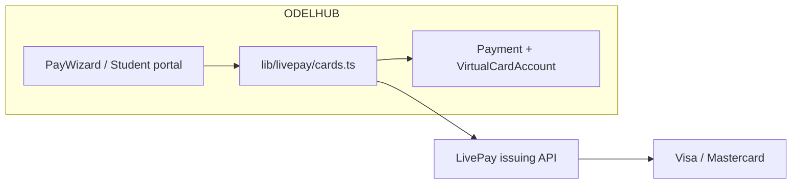

# Virtual card investigation (holistic)

**Date:** 2026-06-09 · **Status:** Investigation complete · **App:** ODEL HUB Pay / **OpenPayGB** · **Primary market:** Uganda (UGX), multi-rail tuition

This document answers: *How could we offer “our own” virtual card?* — legally, technically, and inside the existing ODEL HUB architecture.

### Investigation conclusion (2026-06-09)

| Decision | Recommendation |
|----------|----------------|
| **Shipped today** | **Option 4 — closed-loop OpenPayGB Card** (`OpenPayCard` model, UGX balance, tuition pay-from-card, MoMo/TON top-up). Not a Visa/MC network card. |
| **Next revenue lever** | **Option 3 — card acquiring** on `PayWizard` (pay tuition with bank card) via Flutterwave/Paystack hosted checkout. |
| **Long-term differentiator** | **Option 1 — LivePay card issuing API** once LivePay provides docs + sandbox (same vendor as MoMo collect). |
| **Do not pursue** | Option 5 (own BIN / full issuer). Option 2 (second issuer) unless LivePay card API unavailable. |

**Code references (closed-loop MVP):** `lib/openpay-card.ts`, `app/api/student/openpay-card/**`, `app/api/public/checkout/openpay-card-pay`, `components/admin/MasterOpenPayCardSettings.tsx`, `/admin/master#openpay-cards-overview`.

---

## 1. Define the product (three different things)

People say “virtual card” for three unrelated products. Pick one before building.

| Product | Who gets the card | Money flow | “Own” means | Fit with ODEL HUB today |
|--------|-------------------|------------|-------------|-------------------------|
| **A. Issuing** | Student / parent / school staff | Platform loads USD/UGX balance → user spends at Visa/MC merchants | **OpenPayGB**-branded Visa/MC in wallet | **New** — not in codebase |
| **B. Acquiring** | Payer at checkout | Payer enters card → tuition settles to school/platform | Accept **card payments** on `/pay` | **New** — no card rail in `PaymentRail` |
| **C. Closed-loop** | Student on platform only | Internal ledger only — “card” is UI for wallet balance | **Not** a real network card; no Visa/MC | **Easiest** — resembles wallet + spend rules |

**Current codebase:** Tuition settles via **TON**, **Mbiyo**, **LivePay** (UG MTN/Airtel), legacy **MoMo bridge**. The Prisma `Card` model is **Play Hub collectibles**, not payments.

```prisma
enum PaymentRail {
  telegram | web | momo_bridge | mbiyo | livepay
  // no: card | virtual_card
}
```

---

## 2. What “make our own” actually requires (real Visa/Mastercard)

You **cannot** mint scheme-compliant PANs yourself without:

1. **Card scheme membership** (Visa/Mastercard) — multi-year, capital-heavy, or…
2. **BIN sponsorship / issuer processor** — partner holds the license; you are **program manager** (fintech), or…
3. **Bank-led program** — licensed bank is issuer of record; you integrate API.

Typical African fintech path: **#2 or #3** — “OpenPayGB Card” is **branding + UX + ledger**, backed by Bridgecard, Maplerad, Flutterwave Issuing, Sudo, Union54, UQPAY, or **LivePay card API** (if enabled on your account).

### Regulatory & compliance (Uganda + cross-border)

| Layer | Issuing (A) | Acquiring (B) |
|-------|-------------|---------------|
| **Bank of Uganda** | Partner usually holds EMI/bank relationship; you need legal review for program manager role | Payment service provider / aggregator rules for card acceptance |
| **KYC/AML** | Per cardholder (ID, address, PEP/sanctions) before `cardholder_id` | Lighter for one-off checkout; still PCI |
| **PCI DSS** | **Never** store full PAN/CVV on your MongoDB — use issuer iframe/tokenization | SAQ A (redirect) or SAQ D if you host card fields |
| **3DS** | Issuer handles auth webhooks for spend | Required for many cross-border e-commerce flows |
| **Data** | PAN reveal via issuer secure API only; audit logs | Stripe-style token: `pm_xxx` only in your DB |

**Bottom line:** “Own virtual card” in production = **your brand + your app + your policies**, on top of **someone else’s BIN and license**.

---

## 3. Strategic options (ranked for ODEL HUB)

### Option 1 — **LivePay virtual card API** (best alignment)

You already integrate LivePay for **collect-money** (`lib/livepay/client.ts`, `livepay-start`, webhooks).

LivePay markets **Visa & Mastercard virtual cards** (USD/UGX) and **card issuing API** on [livepay.me](https://livepay.me/) — separate from the public MoMo docs (`collect-money`, `send-money`, …).

| Pros | Cons |
|------|------|
| Same KYC/account relationship as MoMo rail | Card API docs not in public MoMo doc site — **request from LivePay** |
| Uganda-first brand story | IP allowlist already bit you on collect — same for card API |
| OpenPayGB narrative: MoMo in + card out | Funding model: prefund issuing wallet |

**Architecture sketch:**



**ODEL HUB changes (medium):** `VirtualCard` + `Cardholder` models, `POST /api/public/cards/issue`, webhooks `card.create.*`, master funding dashboard, **no PAN in logs**.

---

### Option 2 — **Regional issuer API** (Bridgecard, Maplerad, Flutterwave Issuing)

| Provider | Strength | Typical currency | Notes |
|----------|----------|------------------|-------|
| [Bridgecard](https://docs.bridgecard.co/) | Nigeria/Africa issuing, USD virtual, cardholder KYC API | USD (common) | YC-backed; sandbox issuing wallet |
| [Maplerad](https://maplerad.dev/reference/create-a-card) | Branded Visa/MC, virtual + tokenized | USD | `customer_id`, pre-fund amount |
| [Flutterwave](https://flutterwaveinc.mintlify.app/api-reference/virtual-cards/create-a-virtual-card) | Virtual card create + billing fields | USD / debit from NGN etc. | Strong in NG; check UG entity |

**Pros:** Documented REST, webhooks, sandbox. **Cons:** Second vendor beside LivePay; treasury in USD; school/tuition story is UGX-first.

**Fit:** Good if LivePay card API is unavailable or expensive — **OpenPayGB** becomes issuer program on Bridgecard/Maplerad.

---

### Option 3 — **Card acquiring on checkout** (pay tuition with Visa/MC)

Not “issuing” — students **pay** fees with a bank card.

| Provider | Integration |
|----------|-------------|
| Flutterwave / Paystack | Hosted checkout or inline; UGX/NGN settlement |
| Stripe | If supported for UG merchant account |
| Pesapal / regional | East Africa checkout |

**ODEL HUB fit:** New `PaymentRail.card` → `POST /api/public/checkout/card-start` → redirect/Elements → webhook `payment_intent.succeeded` → same `confirmPayment` path as LivePay.

**Pros:** Directly increases tuition conversion. **Cons:** High fees (~3–4%+), chargebacks, dispute handling, school payout timing.

---

### Option 4 — **Closed-loop “OpenPayGB Card”** (not a real network card)

Internal wallet per student: balance from confirmed `Payment`, spend only on approved merchants (tuition installments, approved vendors).

| Pros | Cons |
|------|------|
| No BIN sponsor; fast to ship | Does not work on Netflix, Amazon, international ads |
| Full control in MongoDB | Marketing “virtual card” must be honest (“platform wallet”) |
| Reuse `Payment`, org scope, installments | Not a differentiator vs simple wallet |

**Fit:** Good **MVP narrative** while negotiating issuer API; **do not** display Visa logo unless backed by scheme.

---

### Option 5 — **Build a full issuer** (not recommended)

Own BIN, scheme agreements, authorization switch, settlement with Bank of Uganda.

**Timeline:** years · **Capital:** very high · **Only** if OpenPayGB becomes a licensed institution.

---

## 4. How this maps onto ODEL HUB Pay (technical)

### Reuse patterns you already have

| Existing pattern | Reuse for virtual cards |
|------------------|-------------------------|
| `PaymentRail` + `createPendingPayment` | Add `card_acquiring` or link card spend to ledger entries |
| `livepay-start` + webhook confirm | Mirror: `card-issue` + `card.transaction` webhooks |
| `lib/api-error.ts`, rate limits | Same for card APIs |
| `ProcessedWebhook` dedupe | Card issuer webhooks |
| `Organization` tenant + master console | Per-org card program toggles, spending caps |
| OpenPayGB branding (`lib/open-pay-brand.ts`) | Card art, product name |

### New components (issuing path)

1. **Models** — `Cardholder` (KYC status), `IssuedCard` (issuer id, last4, brand, currency, status), `CardLedgerEntry` (load/spend/refund).
2. **Secrets** — `LIVEPAY_CARD_*` or `BRIDGECARD_*`; separate from MoMo keys.
3. **APIs** — issue, freeze, fund, list transactions (proxy to issuer).
4. **UI** — Student: “Get OpenPayGB Card”; Master: prefund float, compliance export.
5. **Never** store: full PAN, CVV, PIN — only issuer tokens / masked PAN.

### Acquiring path (pay with card)

1. `PaymentRail.card` on checkout.
2. Quote still in **UGX**; acquirer settles UGX or FX.
3. Webhook confirms → existing `handleFirstTimeConfirmation`.

---

## 5. Economics & treasury (often underestimated)

| Topic | Issuing | Acquiring |
|-------|---------|-----------|
| **Float** | You prefund issuer wallet (USD) before users spend | Acquirer settles T+N to your bank |
| **FX** | UGX tuition vs USD card — spread risk | Card may be USD; display UGX quote clearly |
| **Revenue** | Interchange share (if program allows), issuance fee, FX markup | MDR minus scheme fees |
| **Cost** | Per-active-card monthly, KYC per user, failed auth | Chargebacks, 3DS friction |

For **tuition**, issuing is usually **secondary** (students need international spend); **acquiring** directly completes fee payment.

---

## 6. Recommended roadmap

### Phase 0 — Decision (1 week)

- [ ] Choose **A issuing**, **B acquiring**, or **both**.
- [ ] Ask **LivePay** for card issuing API docs, pricing, UG entity, IP allowlist, sandbox.
- [ ] Legal: program manager vs reseller terms (Uganda counsel).

### Phase 1 — Low risk (4–8 weeks)

- **Acquiring:** Flutterwave/Paystack hosted pay for `PaymentRail.card` on `PayWizard` (if settlement to schools is clear).
- **Or** closed-loop wallet MVP (honest branding, no Visa logo).

### Phase 2 — OpenPayGB Card (8–16 weeks)

- LivePay **or** Bridgecard/Maplerad sandbox.
- Cardholder KYC flow (reuse student identity fields where possible).
- Issue virtual USD card; fund from MoMo collect (you already have `livepay-start`).
- Webhooks + master float monitoring.

### Phase 3 — Product depth

- Per-org limits (schools), student stipend cards, receipt linking `IssuedCard` ↔ `Payment`.
- Apple/Google Pay push provisioning (issuer-dependent).

---

## 7. What to avoid

- Storing PAN/CVV in `Payment` or logs.
- Marketing “Visa card” on closed-loop wallet only.
- Duplicating LivePay + Bridgecard + Stripe issuing without treasury ops.
- Ignoring **IP allowlist** and **prefund** ops (same class of failure as `livepay-start` 502).
- Touching Play Hub `Card` / `UserCard` models for payments — keep game and payments separate.

---

## 8. Immediate next actions (operator)

1. **Email LivePay:** “Card issuing API documentation, sandbox, UGX vs USD cards, pricing, webhook events.”
2. **Parallel RFP:** Bridgecard + Maplerad sandbox keys for USD virtual compare.
3. **Product:** Decide tuition **accept card** vs student **receive card** (or both).
4. **Engineering spike (2–3 days):** `PaymentRail` design doc + stub `lib/card-issuing/README.md` — no production until issuer contract signed.

---

## 9. Summary

| Question | Answer |
|----------|--------|
| Can we “make our own” virtual card? | **Yes as a branded program** on an issuer API; **no** as a standalone scheme without a bank/partner. |
| Fastest path with current stack? | **LivePay card API** (same vendor as MoMo) or **card acquiring** on checkout for tuition. |
| Fastest *engineering* MVP? | Closed-loop wallet (not real Visa/MC). |
| Fits `PaymentRail` pattern? | **Yes** — add `card` / `virtual_card` + webhook + confirm pipeline like `livepay`. |
| Biggest blockers? | **License/KYC/treasury**, not React UI. |

---

## Related docs

- [LIVEPAY_INTEGRATION_ASSESSMENT.md](../deployment/LIVEPAY_INTEGRATION_ASSESSMENT.md) — MoMo collect (implemented)
- [ECONOMICS.md](../economics/ECONOMICS.md) — UGX / TON settlement
- [SIS_INTEGRATION_COOKBOOK.md](./SIS_INTEGRATION_COOKBOOK.md) — checkout integration
- [SECURITY_HARDENING.md](../operations/SECURITY_HARDENING.md) — webhooks, PCI-minded patterns
- [BACKLOG.md](../product/BACKLOG.md) — track card program once product owner picks A/B/C
