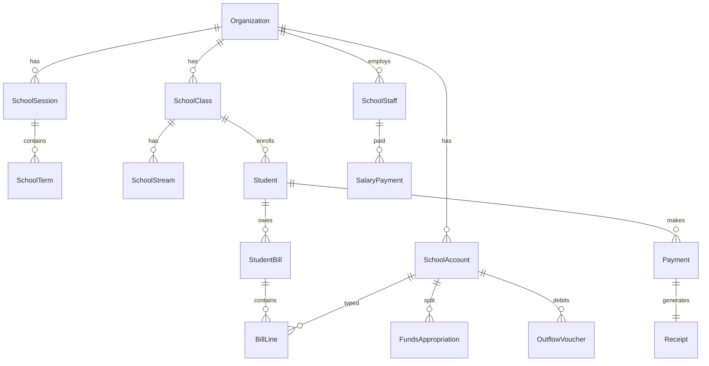

# School Fees & Payments — deep scan (OdelPay Schools)

**Source folder:** [`School Fees and Payments Software Images/`](../School%20Fees%20and%20Payments%20Software%20Images/)  
**Reference product:** HisGrace Gestio HAC / Software Innovations (desktop)  
**Scan date:** 2026-07-12 — 52 files (47 PNG, 2 TXT, 1 DOCX, 2 duplicate filenames)

---

## 1. Application shell (every screen)

```
┌─────────────────────────────────────────────────────────────────┐
│ Logo │ SOFTWARE INNOVATIONS │ DateTime │ Term▾ │ 2023/2024 ✓ │ admin │ Logout │ License │ About │
├──────────┬──────────────────────────────────────────────────────┤
│ Sidebar  │  Module title + filters + main workspace            │
│ (12)     │  [modals / side panels / bottom action bars]          │
├──────────┴──────────────────────────────────────────────────────┤
│ Footer: license tier — "BASIC: 90 days remaining"               │
└─────────────────────────────────────────────────────────────────┘
```

### Sidebar (fixed order)

| # | Module | Icon role |
|---|--------|-----------|
| 1 | Dashboard | Overview KPIs |
| 2 | Session | Academic year lifecycle |
| 3 | Accounts | Chart of accounts |
| 4 | Class Registration | Class codes |
| 5 | Students / Bills | Students + fee assignment |
| 6 | Defaulters | Arrears tracking |
| 7 | Receipt of Payments | Payment ledger |
| 8 | Staff | HR + payroll |
| 9 | Outflow | Vouchers + salary disbursement |
| 10 | Inventory | Stock (no screenshot in pack) |
| 11 | Reports | Financial + records statements |
| 12 | Settings | Funds appropriation (+ more TBD) |

### Global context (header)

Two values drive **every** module:

| Key | UI control | Example | Scope |
|-----|------------|---------|-------|
| **Active session** | Set via Session → Activate | `2023/2024` | Whole school year |
| **Active term (global)** | Header dropdown | `THIRD` (1st / 2nd / 3rd) | All fee/bill/defaulter views |

Many screens **also** have a local Term dropdown (must stay in sync with global).

**OdelPay mapping:** `Organization.currentAcademicYearLabel` + new `SchoolSession` + `activeTerm` on org or session.

---

## 2. Module deep dive

### 2.1 Dashboard (`1.`)

Six KPI cards:

| Card | Metrics |
|------|---------|
| **Accounts** | Pie: recovery %; Expected / Received / Outstanding (UGX) |
| **Cashflows** | Total income, expenditure, net balance |
| **Defaulters** | Responding / Overdue / Total due counts |
| **Students** | Male / Female / Total (+ gender pie) |
| **Staff** | Teaching / Non-teaching / Total |
| **Inventory** | Available / Unavailable / Total item types |

Sample data: Expected UGX 49,739,033; Received 34,215,033; Outstanding 15,524,000; 16 overdue defaulters; 27 students.

---

### 2.2 Session (`2.`–`6.`)

**Hub:** 4 large tiles — New | Edit | Activate | Delete.

| Action | UI | Behaviour |
|--------|-----|-----------|
| New | Right panel: Session Name + **Add** | Creates year label e.g. `2024/2025` |
| Edit | Select session ▾ + Enter New Session Name + **Save** | Rename |
| Activate | Select session ▾ + **Activate** | Sets active session for whole app |
| Delete | Confirm dialog | Remove session |

Screens: `2`, `2 Session2`, `3`, `4`, `5`, `6`.

**OdelPay entities:** `SchoolSession { id, orgId, label, isActive, createdAt }`.

---

### 2.3 Accounts (`7.`–`9.`, `12.`, `13.`)

**List:** searchable table — `AccountName` | `AccountType`.

**Account types:** `INCOME` | `EXPENDITURE`.

**Income naming patterns (tertiary-style in reference; schools use Term 1–3):**

| Pattern | Examples |
|---------|----------|
| Once | `BURSARY APP. (ONCE)`, `APPLICATION (ONCE)`, `ADMISSION (ONCE)` |
| Per term/sem | `REGISTRATION (PER SEM) YR1 SEM1` … `YR3 SEM2` |
| Per term/sem | `DEVELOPMENT (PER SEM) YR1 SEM1` … |
| Per term/sem | `STUDENTS GUILD (PER SEM) YR1 SEM1` … |
| Other | `STUDENT ID` |

**Expenditure:** `SALARY` (highlighted row in screenshots).

**Add account modal:** Account Name (text) + Account Type (dropdown INCOME default) → **Add Account**.

**Ledger views:** Salary Inflow / Salary Outflow transaction screens (`12`, `13`) — tie payments to expenditure accounts.

**OdelPay entities:** `SchoolAccount { id, orgId, name, type: INCOME|EXPENDITURE, sessionId? }`.

---

### 2.4 Settings — Funds appropriation (`10.`, `11.`)

**Purpose:** Auto-split **incoming fee income** across expenditure accounts by percentage.

| Column | Example |
|--------|---------|
| Expenditure Account | SALARY |
| Percentage (%) of Income | 30 |
| Minimum Balance | 0 |

- Filtered by **Term** (THIRD).
- Footer: **30% Appropriated** | **70% Unappropriated** (must reach 100%).
- **Add New Appropriation** modal: Account Type ▾, Percentage, Minimum Balance (N prefix) → **Appropriate**.

**OdelPay entities:** `FundsAppropriation { orgId, term, expenditureAccountId, percent, minBalance }`.

---

### 2.5 Class registration (`14.`–`19.`)

**List:** class codes e.g. `DEP MTC.AGRIC`, `BEP ENG.RE`, `BSCS`, `DIPLOMA INFO. TECH`.

**Actions:** Import Class | Add New Class | Edit Class | Delete Class.

| Flow | Details |
|------|---------|
| Add | Side panel: Class name → **Add** |
| Edit | Select row → side panel **Update** |
| Delete | Confirm: "Are you sure you want to delete {class}?" Yes/No |
| Import internal | Tabs: Internal / External (Results App); Source **Session** ▾; class checklist; **Include Students In Class** ✓; **Select New Records only**; **Import** |
| Import external | Same modal, External tab — integration with Results App |

**Note:** Reference uses **flat class codes** (tertiary). OdelPay Schools uses **Class + Stream** — map codes to `SchoolClass` + optional `SchoolStream`.

---

### 2.6 Students / Bills (`20.`–`23.`, txt `21`)

**Main list** (filter: Class ▾ + search):

| Column | Example |
|--------|---------|
| Name | NAKITTO AMINAH |
| AdmissionNo | 24/2/TU/1009/BEPX |
| Sex | FEMALE |
| Tel, Email, Address | optional |

Footer: **No. of Students: N**

**Row click** (per `21.txt` + screenshot `21`):

1. **`{Name} (Pay Bill)`** — opens pay-bill flow (screenshot missing)
2. **Edit** — student form
3. **Delete** — confirm "Are you sure you Delete …" Yes/No

**New student modal (`22`):** Name, Admission No, Sex ▾, Class ▾, Contact No., Email, Contact Address → **Add Student**.

**Import students (`23`):** Same pattern as class import — Internal/External, source Session + Class, select rows, **Select New Records only**, **Import**.

**Bottom action bars:**

| Group | Buttons |
|-------|---------|
| **Students Reg.** | New Student, Import, Import List (Excel), Export List (Excel) |
| **Bills Reg.** | Add Bill (Bulk), Import Bills (Excel), Export Bills (Excel) |

**OdelPay entities:** extend `Student`; new `StudentBill` / `BillLine` per term + account; bulk bill assignment job.

---

### 2.7 Defaulters (`24.`–`27.`)

**Subtitle rules:**

| Tab | Rule text (from UI) |
|-----|---------------------|
| All Due | (default arrears) |
| Overdue | stricter threshold |
| Responding / Pending | "partial payment since 10 days ago" |
| Non-Defaulters | cleared / current |

**Table:** grouped by class header:

`BEP ENG.RE - 1 Defaulter(s) - (UGX2,547,000.00)`

| Column | Format |
|--------|--------|
| Name | |
| Debt Balance | `2,547,000.00` |
| Last Payment Date | `2024-10-04` |
| Last Payment Receipt N… | `RP-87` |

**Exports:** PDF + Excel (bottom right).

**OdelPay:** compute from `StudentBill` balance − payments; group by `SchoolClass`; `/admin/defaulters`.

---

### 2.8 Receipt of payments (`28.`)

| Column | Example |
|--------|---------|
| Receipt No. | RP-5, RP-8, … |
| Date | 2023-11-01 |
| Name | NANKYA AMINA NOOR |
| Class | BEP MTC.AGRIC |
| Term | THIRD |
| Payment Mode | CASH, MOBILE TRANSFER |
| Total Payments | 507,000.00 |

**Export** Excel. Align with OdelPay `/admin/receipts` + existing Payment/Receipt models.

---

### 2.9 Staff (`29.`–`34.`)

**Tabs:** Active Staff | Inactive Staff | Salary Payment History | Staff Profile.

**Grouped header:** `TEACHING STAFF: 1 Staffer(s) (UGX900,000.00)`.

| Field | Example |
|-------|---------|
| StaffID | S001 |
| Name | JUMA A |
| Tel | +256700343536 |
| Address | KAMPALA |
| Email | jumaa@gmail.com |
| Sex | MALE |
| EmploymentDate | 2023-12-31 |
| Duty | DOS |
| Salary | 900,000.00 |

Footer: Total Staff Members, Total Amount (UGX).

**OdelPay entities:** `SchoolStaff { staffId, orgId, name, duty, salary, active, … }`.

---

### 2.10 Outflow (`35.`–`38.`)

**Hub (`35`):** two tiles — **Voucher** | **Salary Payment**.

#### Voucher — Make Payment (`36`, `37`)

Tabs: **Make Payment** | **Payment History**.

| Field | Purpose |
|-------|---------|
| Term ▾ | THIRD |
| Account ▾ | Expenditure account |
| Available Fund | Balance display |
| Payee | Text |
| Payer ▾ | Source |
| Line items | Particulars + Amount (multi-row) |
| Notes | Text area |
| **Disburse** | Submit |

#### Salary Payment (`38`)

| Field | Example |
|-------|---------|
| Month ▾ | January 2025 |
| Staff list | JUMA A (selected) |
| Status | Not Paid |
| Gross Pay | 900,000.00 |
| Deduction | 0.00 (editable) |
| Net Pay | 900,000.00 |
| **Pay** | Disburse |

**Footer stats:** Salary account balance UGX 10,264,509.90; budget UGX 900,000; paid/unpaid counts; bar chart.

**OdelPay entities:** `OutflowVoucher`, `SalaryPaymentRun`, link to `SchoolAccount` SALARY.

---

### 2.11 Reports (`39.`–`49.`)

#### Hub layout (`39`)

**Financial Metric Statements**

| Tile | Screens |
|------|---------|
| Cash Flow Statement | `40`–`43` |
| Profit and Loss (Inventory) | `44`–`47` |

**Records Statements** (6 modules per `Fees and Payments Explanation.txt`)

| Tile | Screens in pack | Status |
|------|-----------------|--------|
| Class Bills Summary | `48` | ✅ |
| Student Account Statement | `49` | ✅ |
| Payroll | — | ❌ missing |
| Bill Account Statement | icon only | ❌ missing |
| Expense Account Statement | icon only | ❌ missing |
| Inventory Account Statement | icon only | ❌ missing |

#### Generator patterns

| Report | Parameters | Action |
|--------|------------|--------|
| Cash Flow | Period toggle: **Term** \| **Date Range**; Term ▾ | Generate |
| P&L | Report Period: Term \| Date Range; Term ▾ | Generate |
| Class Bills Summary | Class ▾ + Term ▾ | Generate |
| Student Account | Class ▾ + student search/list + Term ▾ | View |

**Cash flow output (`40`):** CASH INFLOW / CASH OUTFLOW sections; columns S/N, DATE, TRACK ID, NAME, PARTICULARS, AMOUNT; Print + Export PDF.

---

## 3. Inferred data model (Prisma-oriented)



---

## 4. Workflow map (money)

```
Session activated → Term selected (global)
       ↓
Accounts defined (INCOME fee heads + EXPENDITURE)
       ↓
Funds appropriation (% income → salary etc.)
       ↓
Classes registered → Students enrolled
       ↓
Bills assigned (bulk / import / per student)
       ↓
Student pays → Receipt (CASH / MOBILE TRANSFER)
       ↓
Income pooled → Appropriation split → Outflow (voucher / salary)
       ↓
Reports (cash flow, P&L, class/student statements)
       ↓
Defaulters track unpaid / partial (>10 days rules)
```

---

## 5. OdelPay Schools gap matrix

| Reference module | OdelPay route | Status |
|------------------|---------------|--------|
| Dashboard KPIs | `/admin/school-dashboard` | **Done** — recovery pie, gender pie, all 6 cards |
| Session | `/admin/school-session` | **Done** — CRUD + activate |
| Accounts | `/admin/school-accounts` | **Done** — income/expenditure + ledger |
| Appropriation | `/admin/settings` | **Done** — funds split panel |
| Classes | `/admin/school-structure` | **Done** — import, edit, delete class/stream |
| Students/Bills | `/admin/students` | **Done** — bulk bills, pay bill, CSV import/export |
| Defaulters | `/admin/defaulters` | **Done** — tabs, class-grouped table, CSV export |
| Receipts | `/admin/receipts` | **Done** — receipt no, term, payment mode |
| Staff | `/admin/school-staff` | **Done** — 4 tabs + full form |
| Outflow | `/admin/school-outflow` | **Done** — vouchers + salary + fund guard |
| Inventory | `/admin/school-inventory` | **Done** — CRUD |
| Reports | `/admin/school-reports` | **Done** — 8 tiles, term/date range, CSV + PDF |

---

## 6. K–12 vs reference (tertiary) terminology

| Reference (screenshots) | OdelPay Schools target |
|-------------------------|------------------------|
| YR1 SEM1 … YR3 SEM2 | Primary/Secondary: **Term 1–3** per year |
| Class codes (BEP, DEP) | **Class** (P7, S1) + **Stream** (A, B) |
| THIRD term | Term 3 (same concept) |
| Session 2023/2024 | Academic year label (exists on org) |

Fee account naming should be **tier-aware** via existing `institutionTier` + programme fee UI.

---

## 7. Files not in pack (awaiting uploads)

- Inventory main module
- Pay Bill dialog (referenced in txt only)
- Add Bill (Bulk) screen
- Payroll report
- Bill / Expense / Inventory account statement generators
- Settings beyond appropriation
- Full P&L and Cash Flow **output** PDFs (only chooser + partial cash flow)

---

## 8. Recommended build order

1. **SchoolSession + global term context** (unblocks everything) — **Done**
2. **SchoolAccount + bill assignment** (Students/Bills core) — **Done**
3. **Defaulters + receipt alignment** — **Done**
4. **Funds appropriation + outflow/vouchers** — **Done**
5. **Staff + salary payment** — **Done** (UI + API; payroll report enabled)
6. **Reports hub** (match tile layout from `39`) — **Done** (8 report types + print preview)
7. **Inventory** when images arrive — **Done** (basic CRUD; no reference screenshot)

### Implementation status (2026-07-12)

| Module | Route | Status |
|--------|-------|--------|
| Dashboard | `/admin/school-dashboard` | Live KPIs |
| Session | `/admin/school-session` | CRUD + activate |
| Accounts | `/admin/school-accounts` | Income/expenditure + seed |
| Class registration | `/admin/school-structure` | Import, edit, delete |
| Students / bills | `/admin/students` | Bulk bills, pay bill, CSV import/export |
| Defaulters | `/admin/defaulters` | Tabs, class-grouped headers, CSV export |
| Receipt of payments | `/admin/receipts` | Receipt no, term, payment mode |
| Staff | `/admin/school-staff` | 4 tabs + full profile form |
| Outflow | `/admin/school-outflow` | Vouchers + salary + appropriation guard |
| Inventory | `/admin/school-inventory` | Full CRUD, available/unavailable quantities, unit cost and available stock valuation |
| Reports | `/admin/school-reports` | 8 tiles, inclusive term/date range, CSV + PDF; P&L and expense reports honor date ranges |
| Settings | `/admin/settings` | Funds appropriation panel |

School tenants: sidebar via `TuitionAdminShell`, global **Session + Term** bar, `/admin` redirects to school dashboard.

---

## Related

- [SCHOOL_ADMIN_PROGRAMMES.md](./SCHOOL_ADMIN_PROGRAMMES.md)
- [PRODUCT_LINES_AND_SCHOOL_TERMS.md](../platform/PRODUCT_LINES_AND_SCHOOL_TERMS.md)
